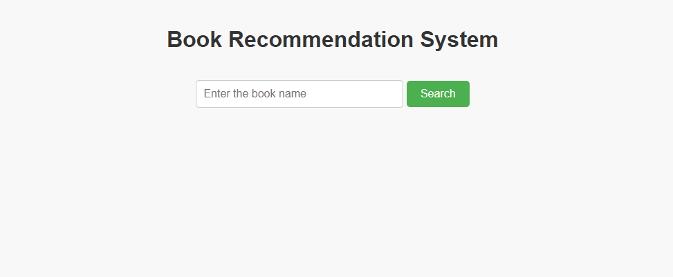

# Book Recommendation System

## Table of Contents

- [Description](#description)
- [Features](#features)
- [Installation](#installation)
- [Usage](#usage)
- [Technologies Used](#technologies-used)

## Description

The Book Recommendation System is designed to provide book recommendations based on content-based filtering techniques. The system uses Natural Language Processing (NLP) to analyze the content of books and suggest similar titles. By leveraging BERT embeddings and TF-IDF, the system generates precise recommendations by understanding the semantic meaning of book descriptions.

## Features

- **Content-Based Filtering**: Recommends books based on their content similarity.
- **Keyword Extraction**: Utilizes KeyBERT for extracting relevant keywords from book descriptions.
- **Vectorization**: Uses TF-IDF to convert keywords into numerical vectors.
- **Cosine Similarity**: Measures the similarity between book vectors to find the best matches.
- **FastAPI Integration**: Provides a RESTful API for easy access to recommendations.

## Installation

To install and run the Book Recommendation System locally, follow these steps:

1. Clone the repository:
   ```bash
   git clone https://github.com/rahma-muhammad/book-recommender.git
   cd book-recommender
   ```
2. Create and activate a virtual environment:
   ```bash
    python -m venv env
    source env/bin/activate  # On Windows, use  `env\Scripts\activate`
    ```
3. Install the required packages:

    ```bash
    pip install -r requirements.txt
    ```
4. Run the FastAPI server:
    ```bash
    cd backend
    uvicorn main:app --reload
    ```

## Usage
**Web Interface**

- Open your web browser and navigate to http://127.0.0.1:8000.
- Enter the name of a book you like.
- The system will display a list of similar books based on the content of your input.
Example Screenshots

**Home page of the Book Recommendation System where users can enter the book name.**




**Example of recommendation results for a given book.**


## Technologies Used
- Programming Language: Python.
- Web Framework: FastAPI.
- NLP Libraries: BERT, TF-IDF, KeyBERT.
- Data Visualization: T-SNE for dimensionality reduction and visualization of word embeddings.
- Deployment: Uvicorn server.